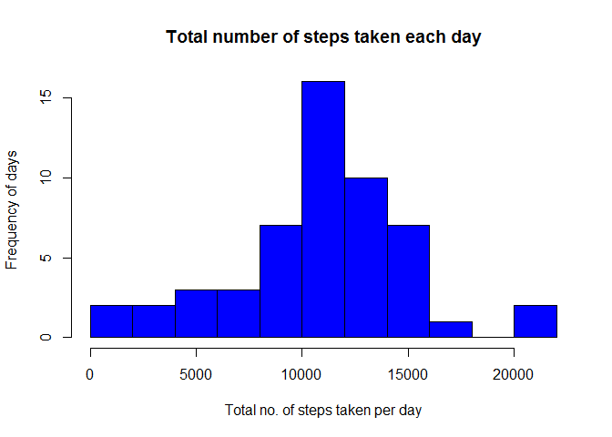
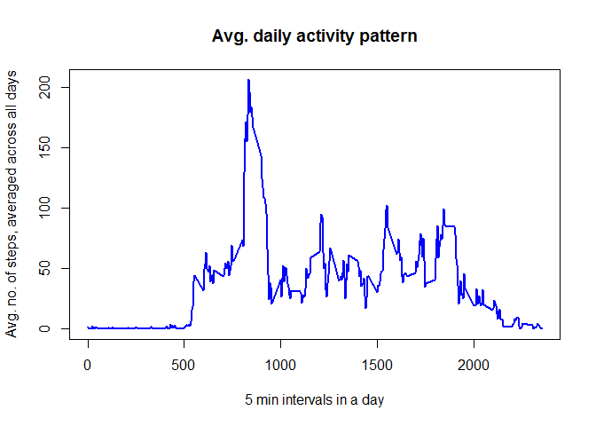
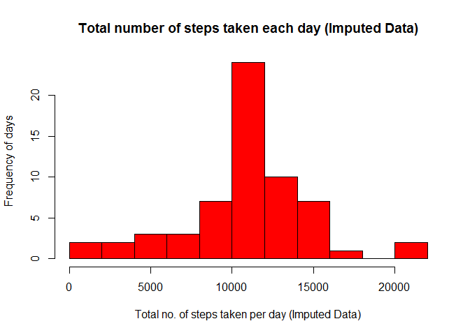
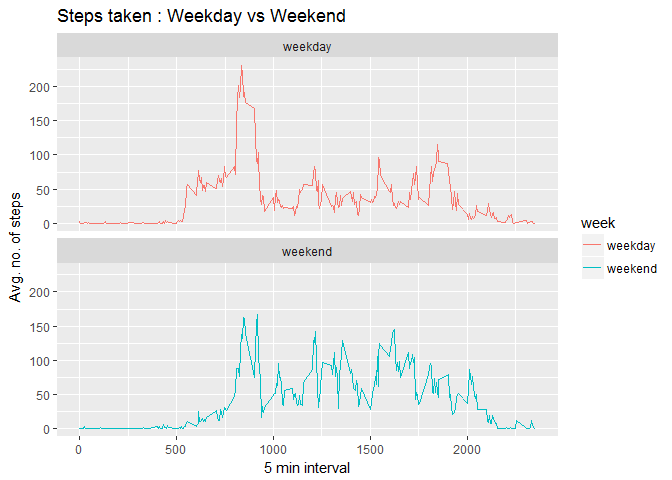

# Reproducible Research: Peer Assessment 1


## Loading and preprocessing the data  
In the current working directory create a new directory named, data. The raw data is downloaded and unzipped here.  
If we are re-running this file then the raw data need not be downloaded again. Changing the working directory is enough.  


```r
if (!file.exists("data")) {
        dir.create ("data")
        fileUrl <- "https://d396qusza40orc.cloudfront.net/repdata%2Fdata%2Factivity.zip" 
        download.file (fileUrl, destfile = "./data/activity.zip")
        setwd("./data")
        unzip ("activity.zip")
}

data <- read.csv("activity.csv")
```

## What is mean total number of steps taken per day?  
For this analysis we ignore the missing data using the function na.omit (). 

- Total no of steps taken per day is calculated using the group_by() and summarise() functions from the dplyr package
- Histogram of total steps per day is plotted using the hist() function in the base plotting system
- mean and median of the total number of steps taken per day is calcualted using the functions mean() and median() on the data obtained in step1


```r
no.na.data <- na.omit(data)
library("dplyr")
```

```
## 
## Attaching package: 'dplyr'
```

```
## The following objects are masked from 'package:stats':
## 
##     filter, lag
```

```
## The following objects are masked from 'package:base':
## 
##     intersect, setdiff, setequal, union
```

```r
by_date <- group_by(no.na.data, date)
steps.by.date <- summarise (by_date, sum (steps))
hist (steps.by.date$`sum(steps)`, xlab = "Total no. of steps taken per day", ylab = "Frequency of days", main = "Total number of steps taken each day", col="blue", breaks = 10)
```

<!-- -->

```r
hist_mean <- mean (steps.by.date$`sum(steps)`)
hist_mean
```

```
## [1] 10766.19
```

```r
hist_median <- median (steps.by.date$`sum(steps)`)
hist_median
```

```
## [1] 10765
```


## What is the average daily activity pattern?
For this analysis we ignore the missing data (calculated before step 1 in above question).  

- Average no. of steps taken per 5 min interval across all days is calculated using the group_by() and summarise() functions from the dplyr package  (dplyr package already loaded in the above question)
- Time series plot of avg. steps per interval is plotted using the plot() function in the base plotting system
- To find which 5 min interval has the maximum number of steps across all days we use the function max() on the data obtained in step1


```r
by_interval <- group_by(no.na.data, interval)
steps.by.interval <- summarise (by_interval, mean (steps))
plot (y=steps.by.interval$`mean(steps)`, x=steps.by.interval$interval, xlab = "5 min intervals in a day", ylab = "Avg. no. of steps, averaged across all days", main = "Avg. daily activity pattern", type = "l", col="blue", lwd=2)
```

<!-- -->

```r
plot_max <- subset (steps.by.interval, steps.by.interval$`mean(steps)` == max (steps.by.interval$`mean(steps)`))
plot_max
```

```
## # A tibble: 1 × 2
##   interval `mean(steps)`
##      <int>         <dbl>
## 1      835      206.1698
```


## Imputing missing values
- The total number of missing values in the given data set can be found by using the sum() function over the result of is.na() function 
- Given data set is copied for filling the NA values 
- To fill the missing values in the give data, the first suggestion is tried viz., using mean/median for the day. But there are 8 days for which no activity is recorded. (NaN values). So we cannot use the first option to fill missing values. So the second suggestion viz., using the mean for the 5 min interval is followed here. tapply () function is used find the mean steps over 5 min intervals across all days, as it returns a vector as output with reference names. Matching these reference names with the intervals having NAs, we can fill the NAs.
- Histogram of total steps per day is plotted using the hist() function in the base plotting system. mean and median of the total number of steps taken per day is calcualted using the functions mean() and median() on the data obtained in step3. After imputing missing values, mean remained the same. But median shifted to mean. 


```r
no.of.nas <- sum(is.na (data$steps))
data.impute <- data
na_rows <- is.na(data.impute$steps)
mean.steps.by.date <- tapply (data.impute$steps, data.impute$date, mean, na.rm=TRUE)
mean.steps.by.date
```

```
## 2012-10-01 2012-10-02 2012-10-03 2012-10-04 2012-10-05 2012-10-06 
##        NaN  0.4375000 39.4166667 42.0694444 46.1597222 53.5416667 
## 2012-10-07 2012-10-08 2012-10-09 2012-10-10 2012-10-11 2012-10-12 
## 38.2465278        NaN 44.4826389 34.3750000 35.7777778 60.3541667 
## 2012-10-13 2012-10-14 2012-10-15 2012-10-16 2012-10-17 2012-10-18 
## 43.1458333 52.4236111 35.2048611 52.3750000 46.7083333 34.9166667 
## 2012-10-19 2012-10-20 2012-10-21 2012-10-22 2012-10-23 2012-10-24 
## 41.0729167 36.0937500 30.6284722 46.7361111 30.9652778 29.0104167 
## 2012-10-25 2012-10-26 2012-10-27 2012-10-28 2012-10-29 2012-10-30 
##  8.6527778 23.5347222 35.1354167 39.7847222 17.4236111 34.0937500 
## 2012-10-31 2012-11-01 2012-11-02 2012-11-03 2012-11-04 2012-11-05 
## 53.5208333        NaN 36.8055556 36.7048611        NaN 36.2465278 
## 2012-11-06 2012-11-07 2012-11-08 2012-11-09 2012-11-10 2012-11-11 
## 28.9375000 44.7326389 11.1770833        NaN        NaN 43.7777778 
## 2012-11-12 2012-11-13 2012-11-14 2012-11-15 2012-11-16 2012-11-17 
## 37.3784722 25.4722222        NaN  0.1423611 18.8923611 49.7881944 
## 2012-11-18 2012-11-19 2012-11-20 2012-11-21 2012-11-22 2012-11-23 
## 52.4652778 30.6979167 15.5277778 44.3993056 70.9270833 73.5902778 
## 2012-11-24 2012-11-25 2012-11-26 2012-11-27 2012-11-28 2012-11-29 
## 50.2708333 41.0902778 38.7569444 47.3819444 35.3576389 24.4687500 
## 2012-11-30 
##        NaN
```

```r
unique (data.impute$date [na_rows])
```

```
## [1] 2012-10-01 2012-10-08 2012-11-01 2012-11-04 2012-11-09 2012-11-10
## [7] 2012-11-14 2012-11-30
## 61 Levels: 2012-10-01 2012-10-02 2012-10-03 2012-10-04 ... 2012-11-30
```

```r
mean.steps.by.int <- tapply (data.impute$steps, data.impute$interval, mean, na.rm=TRUE)
data.impute$steps [na_rows] <- mean.steps.by.int[as.character(data.impute$interval[na_rows])]   
by_date2 <- group_by(data.impute, date)
steps.by.date2 <- summarise (by_date2, sum (steps))
hist (steps.by.date2$`sum(steps)`, xlab = "Total no. of steps taken per day (Imputed Data)", ylab = "Frequency of days", main = "Total number of steps taken each day (Imputed Data)", col="red", breaks = 10)
```

<!-- -->

```r
hist_mean2 <- mean (steps.by.date2$`sum(steps)`)
hist_mean2
```

```
## [1] 10766.19
```

```r
hist_median2 <- median (steps.by.date2$`sum(steps)`)
hist_median2
```

```
## [1] 10766.19
```


## Are there differences in activity patterns between weekdays and weekends?
- using the weekdays () function we find what each day is. Then using for loop we classify weekdays and weekends and store the result in separate column.
- panel plot is made using the ggplot () in the package ggplot2 on the data obtained in step1. On weekdays, the person is active initially but slows down later. On weekends person is active thorughout the day.  

```r
data.impute$day <- weekdays (as.Date(data.impute$date))
for (i in 1:17568) {
        if (data.impute$day [i] == "Saturday" | data.impute$day [i] == "Sunday") {
                data.impute$week [i] <- "weekend"
        }  
        else {
                data.impute$week [i] <- "weekday"
        }
}
by_interval2 <- group_by(data.impute, interval, week)
steps.by.interval2 <- summarise (by_interval2, mean(steps))
library (ggplot2)
g <- ggplot (steps.by.interval2, aes(x=interval, y=`mean(steps)`))
g + geom_line(aes(color=week)) + facet_wrap(~week, nrow=2, ncol=1) + labs (x="5 min interval") + labs (y="Avg. no. of steps") + labs (title="Steps taken : Weekday vs Weekend")
```

<!-- -->


